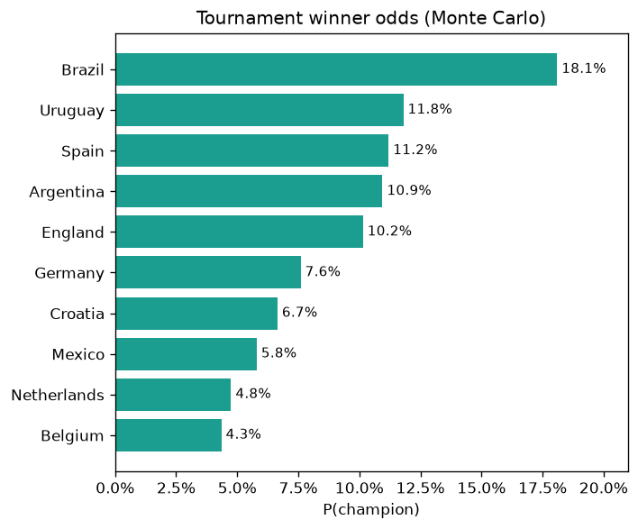
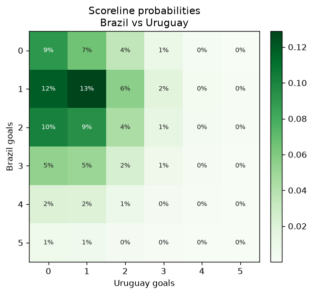
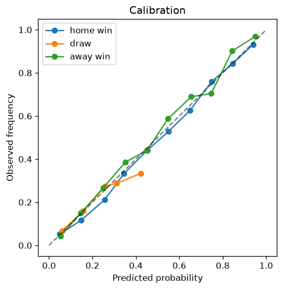

# GoalCast 2026 ⚽


GoalCast 2026 predicts FIFA World Cup 2026 match results and goals, and simulates the whole
tournament with Monte Carlo. I built it to practise taking a machine-learning project the
full way from raw data to a running app, instead of stopping at a notebook.

It covers the whole lifecycle: it pulls and validates the data, builds features (Elo
ratings, recent form, FIFA rankings), trains the models and logs the runs to MLflow, serves
them behind a FastAPI app, and shows the results in a Streamlit dashboard. On top of that
there's drift monitoring and a small "match analyst" that turns a prediction into a
plain-English summary. Every part has an offline fallback (SQLite and a synthetic dataset),
so `make pipeline` works on a fresh clone with no API keys or external services.

## Demo

A few outputs from the offline pipeline. Regenerate them with `make demo-plots` (winner and
scoreline) and `make evaluate` (calibration):

| Tournament winner odds | Scoreline heatmap | Calibration |
|---|---|---|
|  |  |  |

## What it does

- **Two models that complement each other.** A calibrated XGBoost win/draw/loss classifier,
  plus a Dixon-Coles Poisson model for goals and scorelines. I started from simple baselines
  so I could check the bigger models were actually adding something.
- **Evaluation built around probabilities, not just accuracy.** Log loss, Brier score and
  calibration curves, all scored on a time-based split so the model never trains on matches
  from the future.
- **The MLOps side.** MLflow experiment tracking, a model registry that only promotes a new
  model to production if it beats the current one, Docker, and GitHub Actions for CI and a
  scheduled retrain.
- **Data handling.** Ingestion, Pandera schema validation, a handful of data-quality checks,
  and a SQLAlchemy database.
- **Monitoring.** Evidently and PSI for data drift, plus a check of predicted vs actual
  results once games have been played.
- **AI Match Analyst.** Retrieval over the project docs plus Claude to explain a prediction
  in words, with a template fallback when no API key is set.

## Architecture

See [docs/architecture.md](docs/architecture.md).

## Quickstart

```bash
git clone https://github.com/Muzzamil-Codes-dev/goalcast-2026 && cd goalcast-2026
python -m venv .venv && source .venv/bin/activate   # Windows: .venv\Scripts\activate
pip install -r requirements.txt && pip install -e .
cp .env.example .env

make pipeline     # ingest -> features -> train -> evaluate
make serve        # FastAPI at http://localhost:8000/docs
make dashboard    # Streamlit at http://localhost:8501
```

Or run it with Docker and PostgreSQL:

```bash
make up           # postgres + api + dashboard
```

## Project structure

```
src/goalcast/
  data/        ingest, Pandera schema, quality checks, SQLAlchemy DB
  features/    Elo engine, rolling form, feature assembly
  models/      baselines, XGBoost classifier, Poisson, train, evaluate, registry
  simulation/  Monte Carlo group + tournament
  api/         FastAPI app, predictor, schemas
  llm/         RAG + AI Match Analyst
  monitoring/  drift + realized performance
dashboard/     Streamlit multipage product
tests/         unit + API tests
```

## Tech stack

Python, pandas, scikit-learn, XGBoost, statsmodels/scipy, Pandera, SQLAlchemy, MLflow,
FastAPI, Streamlit, Plotly, Evidently, Chroma, Anthropic Claude, Docker, GitHub Actions.

## API endpoints

`GET /health` · `GET /model/info` · `GET /teams` · `POST /predict/match` ·
`POST /predict/scoreline` · `POST /simulate/group` · `POST /simulate/tournament` ·
`POST /explain` · `GET /metrics`

## How the modelling works

I use point-in-time features so nothing leaks from the future, and a time-based train/test
split for the same reason. The classifier's probabilities are calibrated, and the Poisson
goals model does double duty: it gives expected goals and scorelines, and it's also what
drives the tournament simulation. There's more detail in
[docs/knowledge_base](docs/knowledge_base).

## Roadmap

See [ROADMAP.md](ROADMAP.md). Things I'd still like to add: live fixtures from
football-data.org, a DVC remote for the data, and a cloud deployment.

## License

MIT
