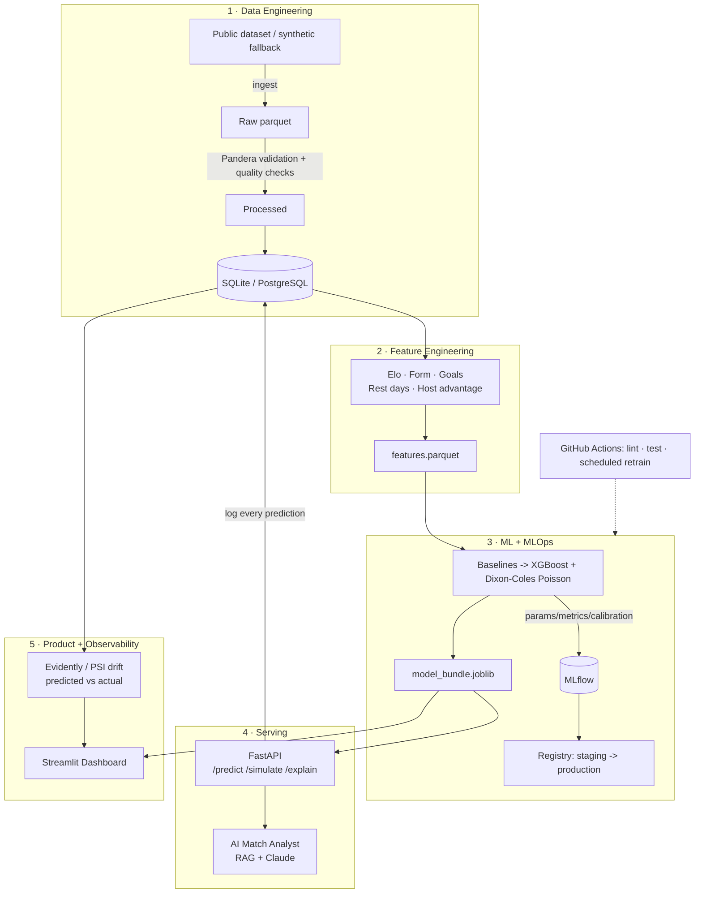

# Architecture

**Data flow:** `raw → validated → features → model → bundle/registry → API → dashboard`,
with every prediction logged back to the database so monitoring can compare predicted
probabilities against real results.
